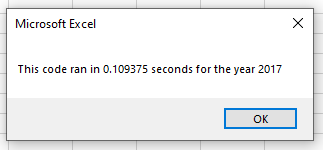
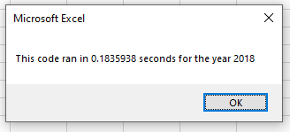

# Stock Analysis with VBA

## Overview of Project

### Purpose
The purpose of this data analysis was to analyze 2017 and 2018 stock data to find the total daily volume and yearly return for each stock using refactored code in order to see which stocks performed best.

## Results

### Stock Performance between 2017 and 2018
The code that was given created an InputBox that would run and analysis on the stock based on the year inputted by the user.
```
yearValue = InputBox("What year would you like to run the analysis on?")
```
The code then formatted the output by:
- having the value in cell A1 say "All Stocks (year inputted by the user)";
```
Range("A1").Value = "All Stocks (" + yearValue + ")"
```
- creating the header rows with "Ticker", "Total Daily Volume", and "Return";
```
Cells(3, 1).Value = "Ticker"
Cells(3, 2).Value = "Total Daily Volume"
Cells(3, 3).Value = "Return"
```
- and initializing an array of the tickers.
```
Dim tickers(12) As String
    
tickers(0) = "AY"
tickers(1) = "CSIQ"
tickers(2) = "DQ"
tickers(3) = "ENPH"
tickers(4) = "FSLR"
tickers(5) = "HASI"
tickers(6) = "JKS"
tickers(7) = "RUN"
tickers(8) = "SEDG"
tickers(9) = "SPWR"
tickers(10) = "TERP"
tickers(11) = "VSLR"
```
I refactored the code to create a tickerIndex variable to access the correct index across four arrays: the ticker (as established above), tickerVolumes, tickerStartingPrices, and tickerEndingPrices.
```
tickerIndex = 0
Dim tickerVolumes(12) As Long
Dim tickerStartingPrices(12) As Single
Dim tickerEndingPrices(12) As Single
```
I created a for loop to initialize the tickerVolumes array to zero.
```
For i = 0 To 11

    tickerVolumes(i) = 0
    
Next i
```
I then created a loop over all the rows. Within the loop, the volume of the current tickerVolumes is increased with the tickerIndex variable as the index. The if-then statements check if the current row is the first row or the last row with the selected tickerIndex. If the current row is the first row, it is assigned the current closing price to the tickerStartingPrices variable. If the current row is the last row, it is assigned the current closing price to the tickerEndingPrices variable. The tickerIndex is then increased if the next row's ticker does not match the previous row's ticker.
```
    '2b) Loop over all the rows in the spreadsheet.
    For i = 2 To RowCount
    
        '3a) Increase volume for current ticker
        tickerVolumes(tickerIndex) = tickerVolumes(tickerIndex) + Cells(i, 8).Value
        
        
        '3b) Check if the current row is the first row with the selected tickerIndex.
         If Cells(i - 1, 1) <> Cells(i, 1) Then
            
                tickerStartingPrices(tickerIndex) = Cells(i, 6).Value
            
        End If
        
        '3c) check if the current row is the last row with the selected ticker
         If Cells(i + 1, 1) <> Cells(i, 1) Then
            
                tickerEndingPrices(tickerIndex) = Cells(i, 6).Value
                
           
                '3d Increase the tickerIndex.
                tickerIndex = 1 + tickerIndex
            
            
        End If
    
    Next i
```
Finally, I created a for loop through the tickers, tickerVolumes, tickerStartingPrices, and tickerEndingPrices arrays to output the "Ticker," "Total Daily Volume," and "Return" columns.
```
For i = 0 To 11
        
    Worksheets("All Stocks Analysis").Activate
    Cells(4 + i, 1).Value = tickers(i)
    Cells(4 + i, 2).Value = tickerVolumes(i)
    Cells(4 + i, 3).Value = (tickerEndingPrices(i) / tickerStartingPrices(i)) - 1
        
Next i
```
The existing code further formatted the table by bolding the headers and adding a bottom border; formatting the numbers in columns B and C with commas and percentages respectively, and autofitting column B. The for loop then loops through the data to determine if the percentages in the Return column are greater than zero, make the cell color green. If it is not greater than zero, it makes the cell red.
```
Worksheets("All Stocks Analysis").Activate
Range("A3:C3").Font.FontStyle = "Bold"
Range("A3:C3").Borders(xlEdgeBottom).LineStyle = xlContinuous
Range("B4:B15").NumberFormat = "#,##0"
Range("C4:C15").NumberFormat = "0.0%"
Columns("B").AutoFit

dataRowStart = 4
dataRowEnd = 15

For i = dataRowStart To dataRowEnd
        
    If Cells(i, 3) > 0 Then
            
        Cells(i, 3).Interior.Color = vbGreen
            
    Else
        
        Cells(i, 3).Interior.Color = vbRed
            
    End If
        
Next i
```
The output from running the code for 2017 and 2018 produces these tables:

.png)

.png)

Based on the tables, we can see that stocks overall did significantly better in 2017 than they did in 2018. In 2017, the only stock with a negative return was TERP with -7.2%. In 2018, 10 of the 12 stocks had negative returns with only ENPH and RUN having positive returns. While there is not enough data to draw a conclusive recommendation on what to invest in, based on this data ENPH and RUN certainly seem like potential candidates to look into further as they were the only two stocks to have positive returns in both 2017 and 2018. Interestingly, RUN, which had a return of 5.5% in 2017, increased their return by a little more than 16 times with a return in 2018 of 84%.

### Comparison of Original Script and Refactored Script
To calcuate the execution times of the scripts, both the original and refactored scripts begin with creating start time and end time variables as single data types where the timer starts after the user inputs the year they would like to run the analysis on.
```
Dim startTime As Single
Dim endTime  As Single

yearValue = InputBox("What year would you like to run the analysis on?")

startTime = Timer
```
The timer then ends at the very end of the script and displays a message box saying how long the code ran in the given year.
```
endTime = Timer
MsgBox "This code ran in " & (endTime - startTime) & " seconds for the year " & (yearValue)
```
The original script timers were as follows:

.PNG)

.PNG)

The refactored script timers were as follows:





We can see from the timers that for both 2017 and 2018, the refactored script decreased the execution times by a little more than half a second.

## Summary of Analysis

### Advantages and Disadvantages of Refactoring Code
Refactoring code does not add new functionality or features, but it can make the overall code more efficient.

Advantages of refactoring code include:

- reducing the amount of redundant, unused, or repeated code;
- helping to find bugs in the code;
- making the code simpler and easier to understand and maintain;
- reducing the execution time and making the program run faster.

While refactoring code can be beneficial, it may not always be useful.

Disadvantages of refactoring code include:

- potentially being time consuming and therefore costly;
- accidentally introducing bugs into the code.

### Advantages and Disadvantages of the Original and Refactored VBA Script

In terms of this data analysis and the comparison between the original and refactored VBA script, there were many clear advantages of the refactoring. Based on the script timers, we can see that the refactored script decreased the execution times by a little more than half a second. While this does not seem like a lot, this is an 85% decrease in execution times between the 2017 scripts and a 76% decrease in execution times between the 2018 scripts. We can clearly see the benefits this would have for much larger data sets and data analysis. I do not believe there were any disadvantages to refactoring this code due to the size of this data analysis, as it was not particularly time consuming and the risk of introducing bugs was low.


